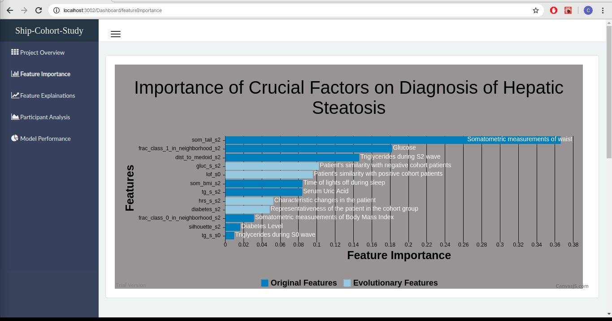
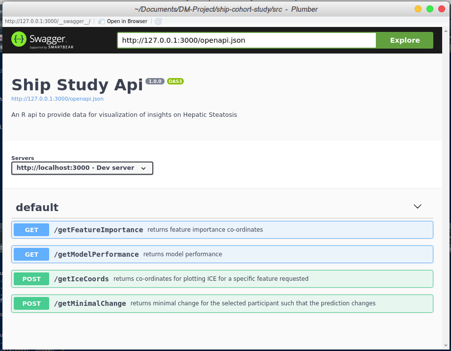

# ShipStudyApi

## Overview

**ShipCohortStudy** is a project aimed at using Interpretable Machine Learning to understand participant evolution in longitudinal cohort study data. **ShipStudyApi** is a restful service that exposes http endpoints to visualize the results of **rulefit** model built on **SHIP dataset**. Additionally, **evoxploit** package is used to augment the dataset with evolutionary features (Niemann et al., 2015) and rules extracted from building random forest on the dataset (Friedman et al., 2008). The feature selection is then performed using Least Absolute Shrinkage and Selection Operator(LASSO) to obtain minimal set of important features (Friedman et al., 2009). 

## Tasks

* Measure the influence of each evolution feature on the predicted class.
* Evaluate the merit of an evolution feature towards classification accuracy.
* Analyse the minimal change in the participant such that the predicted class label changes. 
* Identify the minimal set of evolution features that would result in better predictive performance.

## Usage Example

```r
source('./R/api.R')

# Inspect data
sample_df <- data_df # import dataset here

# Create ShipCohortStudy object
ship_study_results <- ShipCohortStudy$new(sample_df)

# print summary
ship_study_results$summary()
```



```r
# launch api
launchAppDev(port = 3000, ship_study_results = ship_study_results)
```



## Bibliography

- (Niemann et al., 2015) Uli Niemann, Tommy Hielscher, Myra Spiliopoulou, 
Henry Völzke, and Jens-Peter Kühn. "Can we classify the participants of a 
longitudinal epidemiological study from their previous evolution?" 
_Proc. of IEEE Computer-Based Medical Systems_, 121-126, 2015. 
- (Friedman et al., 2008) Friedman, Jerome H.; Popescu, Bogdan E. Predictive learning via rule ensembles. Ann. Appl. Stat. 2 (2008), no. 3, 916--954. doi:10.1214/07-AOAS148.
- (Friedman et al., 2009) Friedman, Jerome, Trevor Hastie, and Robert Tibshirani. “The elements of statistical learning”. 